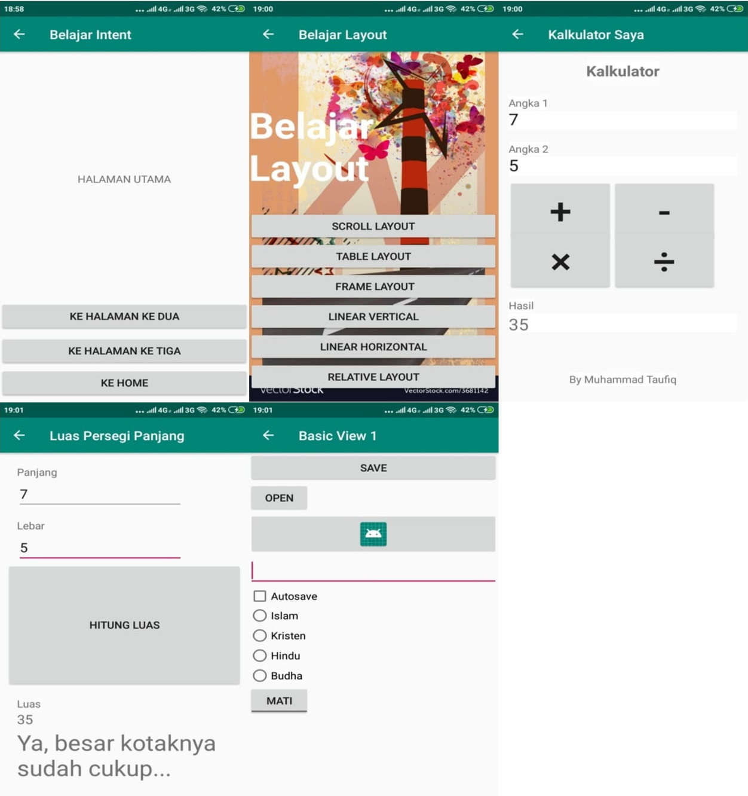

Project BLK Part 1
--
 Deskripsi Fungsi Aplikasi :

    Data Pribadi dapat menampilkan info data pribadi pembuat aplikasi.
    Ganti Gambar dapat mengganti gambar sesuai pilihan yang tersedia.
    Ganti Warna dapat mengganti warna tulisan sesuai pilihan yang tersedia.
    Toast Number dapat menghitung jumlah klik count dan menampilkannya baik dalam text view maupun toast, serta dapat melakukan reset klik count.
    Wasit Digital hampir sama dengan fungsi Toast Number, namun dibuat 2 sisi serta ditambahkan fungsi pengurangan klik count.
    Belajar Intent dapat membawa pengguna dari activity satu ke activity lainnya atau pindah halaman.
    Belajar Layout dapat menampilkan macam macam layout aplikasi android.
    Kalkulator Saya dapat melakukan perhitung seperti kali, bagi, tambah dan kurang.
    Luas Persegi Panjang dapat menghitung luas persegi panjang, serta menerapkan kondisi if pada hasil dari luas persegi panjang.
    Basic View1 dapat menampilkan macam macam basic view aplikasi android.

Screenshot
--

