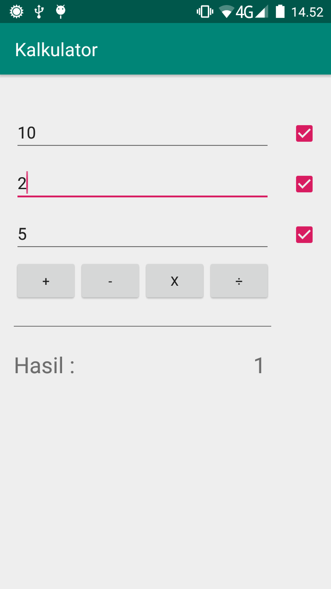

Soal Tes Frontend  (24 jam dari konfirmasi terima soal):
--
Buat sebuah apps kalkulator sederhana dalam bentuk web (menggunakan html, css, javascript, atau  react. Bisa juga dalam bentuk mobile (menggunakan java, kotlin, swift, atau react-native). dengan spek:

    1. Terdapat 3 buah input number yang masing-masing memiliki checklist di sampingnya
    2. Terdapat 4 buah tombol operator yatu: tambah, kurang, kali, bagi.
    3. Bila salah satu tombol operator di klik, maka akan memunculkan angka hasil operasi value dari input-input yang di checklist.
    4. Bila yg di checklist hanya 1 input, muncul pesan error. Bila yang dichecklist hanya 2, maka bilangan yang dichekclist yang hanya akan di operasikan. Bila 3 input yang di checklist maka 3 value tersebut akan di operasikan berurutan

Screenshot
--

